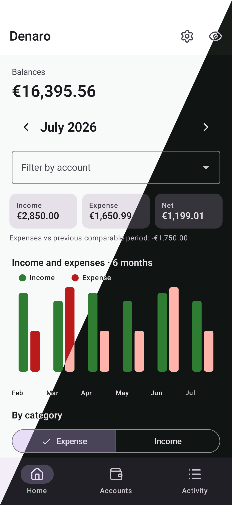
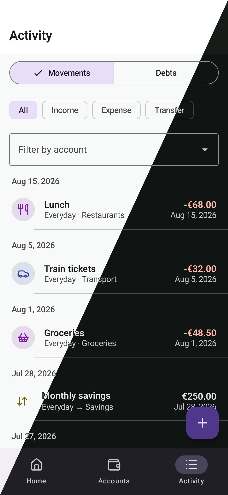
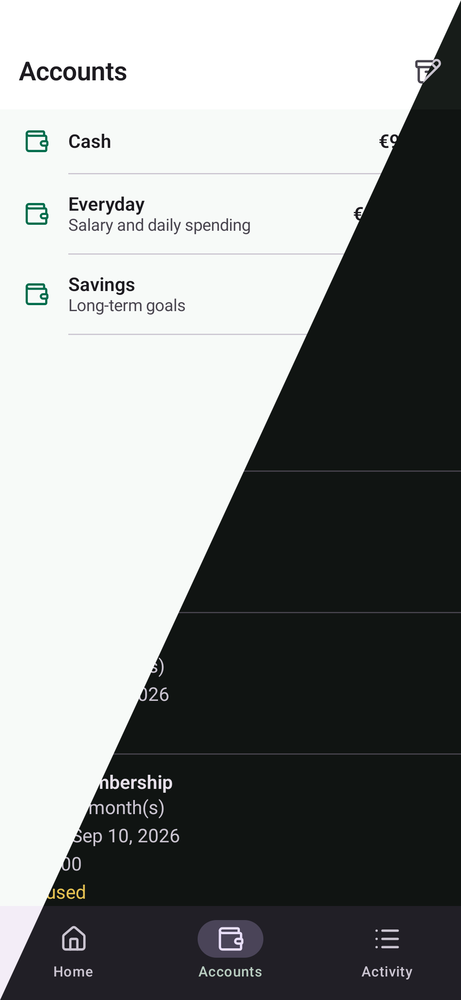
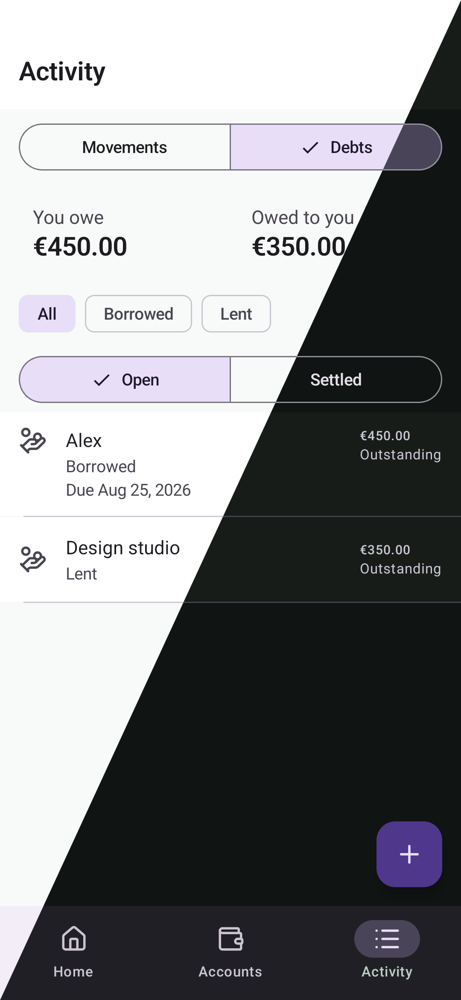

  
  <h1>Denaro</h1>
  
Private, offline-first personal finance for Android.

  
  
  
  

Denaro keeps accounts, income, expenses, transfers, debts, and recurring activity together. Monthly trends and customizable categories make it easier to understand where money goes, while the encrypted local database keeps financial data on the device.

## Highlights

- Multiple accounts, currencies, transfers, and recurring transactions
- Borrowing and lending with counterparties, due dates, and partial repayments
- Monthly cash-flow trends, category breakdowns, and activity filters
- Custom categories, hidden balances, light and dark themes
- No account required and no network permission

## Development

Install JDK 21, then build the debug APK with `./gradlew :app:assembleDebug`.
Debug builds also provide an isolated demo mode under Settings, with realistic
data regenerated whenever it is activated.

## License

See [LICENSE](LICENSE).
